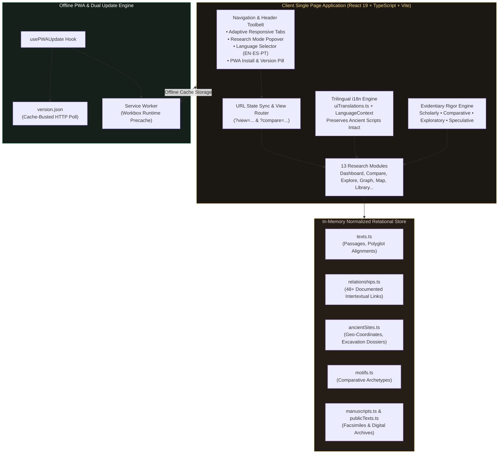
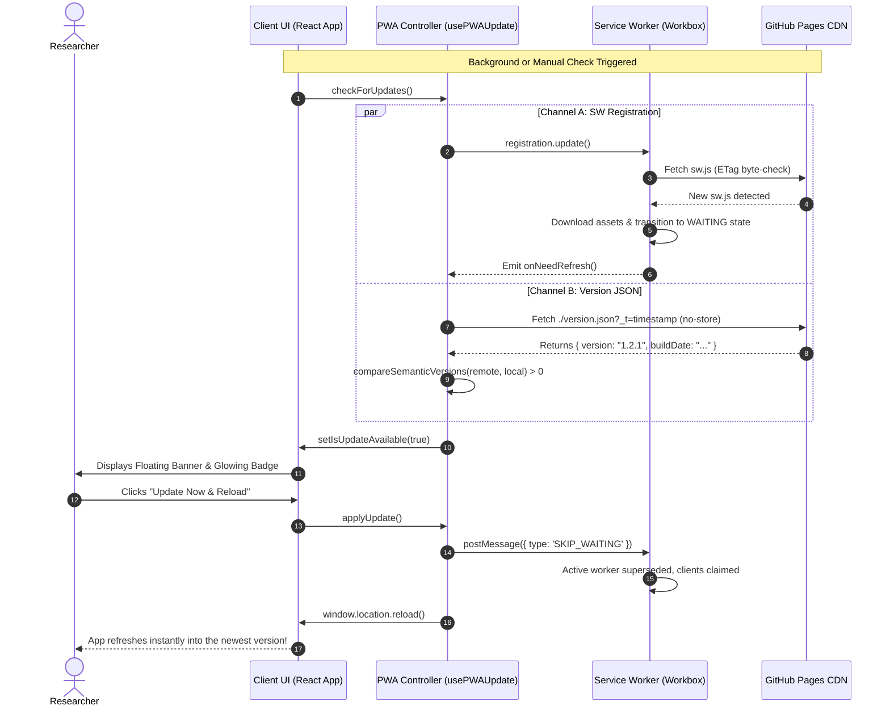

# Chronos & Canon: Ancient Text Comparative Archive

> An advanced, open-access scholarly comparative platform and interactive relationship explorer connecting Mesopotamian cuneiform literature, Ugaritic poetry, Biblical Hebrew & Aramaic corpora, the Dead Sea Scrolls, classical Greek texts, and apocryphal traditions. Built as an offline-first Progressive Web App (PWA) with client-side semantic version control, dual-channel update management, and a full trilingual scholarly apparatus (English, Spanish, Portuguese).

[](https://cptnope.github.io/Chronos-and-Canon/)
[](https://cptnope.github.io/Chronos-and-Canon/)
[](https://cptnope.github.io/Chronos-and-Canon/)
[](https://cptnope.github.io/Chronos-and-Canon/)
[](https://cptnope.github.io/Chronos-and-Canon/)

---

### 🌐 Live Production Application
Access the production deployment directly at:
**[https://cptnope.github.io/Chronos-and-Canon/](https://cptnope.github.io/Chronos-and-Canon/)**

---

## Table of Contents
- [1. Executive Overview & Scholarly Purpose](#1-executive-overview--scholarly-purpose)
- [2. How Everything Works: Architectural Deep Dive](#2-how-everything-works-architectural-deep-dive)
  - [2.1 Data Architecture & Relational Typology](#21-data-architecture--relational-typology)
  - [2.2 The Evidentiary Rigor Engine](#22-the-evidentiary-rigor-engine)
  - [2.3 Internationalization (i18n) & Sacred Script Preservation](#23-internationalization-i18n--sacred-script-preservation)
  - [2.4 URL Routing & Shareable State Management](#24-url-routing--shareable-state-management)
  - [2.5 Responsive Layout & Adaptive Typography](#25-responsive-layout--adaptive-typography)
- [3. The 13 Core Research Modules](#3-the-13-core-research-modules)
  - [Module 1: Home Dashboard & Editorial Showcase (`HomeDashboardView`)](#module-1-home-dashboard--editorial-showcase-homedashboardview)
  - [Module 2: Explore Texts & Synoptic Reader (`ExploreTextsView`)](#module-2-explore-texts--synoptic-reader-exploretextsview)
  - [Module 3: Digital Library & Curated Editions (`DigitalLibraryView`)](#module-3-digital-library--curated-editions-digitallibraryview)
  - [Module 4: Synoptic Text Comparison Engine (`CompareView`)](#module-4-synoptic-text-comparison-engine-compareview)
  - [Module 5: Interactive Evidence Graph (`GraphView`)](#module-5-interactive-evidence-graph-graphview)
  - [Module 6: Multi-Millennial Chronological Timeline (`TimelineView`)](#module-6-multi-millennial-chronological-timeline-timelineview)
  - [Module 7: Archaeological Cartography & Excavations (`AncientMapView`)](#module-7-archaeological-cartography--excavations-ancientmapview)
  - [Module 8: Cross-Cultural Thematic Motifs (`MotifHubView`)](#module-8-cross-cultural-thematic-motifs-motifhubview)
  - [Module 9: The Lost 70 Books & 2 Esdras 14 (`SeventyBooksView`)](#module-9-the-lost-70-books--2-esdras-14-seventybooksview)
  - [Module 10: Genesis 6, The Watchers & Giants Dossier (`Genesis6StudyView`)](#module-10-genesis-6-the-watchers--giants-dossier-genesis6studyview)
  - [Module 11: Great Deluge Comparative Matrix (`FloodStudyView`)](#module-11-great-deluge-comparative-matrix-floodstudyview)
  - [Module 12: Manuscript Facsimiles & Cuneiform Tablets (`ManuscriptsView`)](#module-12-manuscript-facsimiles--cuneiform-tablets-manuscriptsview)
  - [Module 13: Epigraphical Research Assistant (`ResearchAssistantView`)](#module-13-epigraphical-research-assistant-researchassistantview)
- [4. Client-Side PWA Version Control & Update Controller](#4-client-side-pwa-version-control--update-controller)
  - [The Challenge: Service Workers & Stale Cache in PWAs](#the-challenge-service-workers--stale-cache-in-pwas)
  - [The Dual-Detection Engine](#the-dual-detection-engine)
  - [PWA Update Sequence (Mermaid Diagram)](#pwa-update-sequence-mermaid-diagram)
  - [Hard Cache Reset & Recovery](#hard-cache-reset--recovery)
  - [Release Workflow for Maintainers](#release-workflow-for-maintainers)
- [5. Progressive Web App (PWA) & Offline Capabilities](#5-progressive-web-app-pwa--offline-capabilities)
  - [Manifest Configuration](#manifest-configuration)
  - [Service Worker & Runtime Precaching](#service-worker--runtime-precaching)
  - [Desktop, Android, and iOS Installation](#desktop-android-and-ios-installation)
- [6. GitHub Pages Deployment Master Guide](#6-github-pages-deployment-master-guide)
  - [Why "Deploy from a branch" Directly Fails with Vite](#why-deploy-from-a-branch-directly-fails-with-vite)
  - [Automated GitHub Actions Deployment (Recommended)](#automated-github-actions-deployment-recommended)
  - [Relative Base Path Configuration](#relative-base-path-configuration)
  - [SPA 404 Routing on GitHub Pages](#spa-404-routing-on-github-pages)
- [7. Local Development & Build Reference](#7-local-development--build-reference)
- [8. Academic Citation & Scholarly Ethics](#8-academic-citation--scholarly-ethics)

---

## 1. Executive Overview & Scholarly Purpose

The ancient Near East was not composed of isolated silos; rather, it constituted a vibrant, interconnected intellectual ecosystem spanning Mesopotamia, the Levant, Egypt, Anatolia, and the Greco-Roman Mediterranean. Literary motifs, theological debates, cosmological structures, and scribal techniques moved fluidly across linguistic and cultural boundaries.

**Chronos & Canon** bridges these disparate corpora into a single, cohesive, high-performance research environment. It allows biblical scholars, assyriologists, classicists, students, and independent researchers to:

1. **Conduct Synoptic Analysis**: Compare Hebrew Bible passages side-by-side with earlier cuneiform prototypes (e.g. *Atrahasis*, *Epic of Gilgamesh*, *Enûma Eliš*) and Ugaritic texts (e.g. *Baal Cycle*, *Rephaim Texts KTU 1.108*).
2. **Track Genealogies of Tradition**: Trace how the enigmatic "sons of God" (*Bene ha-Elohim*) in Genesis 6 evolved through 1 Enoch's Book of the Watchers, the Dead Sea Scrolls Book of Giants, Mesopotamian Apkallu fish-sages, and the New Testament epistles of Jude and 2 Peter.
3. **Examine the Limits of Canon**: Study the broader canon traditions such as the Ethiopian Orthodox 81-book canon (*Mets'hafe Berhan*) and the enigmatic "seventy hidden books" preserved for the wise according to 2 Esdras 14:44–48.
4. **Anchor Literature in Archaeology**: Correlate texts with their physical discovery sites, excavation archives, and high-resolution manuscript facsimiles (Aleppo Codex, Great Isaiah Scroll 1QIsaª, British Museum tablets).

---

## 2. How Everything Works: Architectural Deep Dive



### 2.1 Data Architecture & Relational Typology

All textual, geographical, and relationship records are statically compiled into immutable, strongly-typed TypeScript structures in `/src/data/`. This enables **instant zero-latency client queries**, **full offline execution**, and **zero external backend dependencies**.

Every connection between two texts is classified by **Relationship Type** and assigned an **Evidentiary Rigor Level**:

#### Relationship Types:
- `DIRECT QUOTATION`: Verbatim or near-verbatim citation across languages (e.g. Jude 14–15 directly quoting 1 Enoch 1:9).
- `TEXTUAL DEPENDENCE`: Clear literary borrowing, shared narrative sequencing, or lexical imitation (e.g. Genesis 6–9 and *Gilgamesh Tablet XI*).
- `SHARED TRADITION`: Northwest Semitic or Levantine cultural idioms shared between Ugaritic poetry and Biblical Psalms/Prophets (e.g. Baal and Yahweh as "Rider on the Clouds" *Rōkeb ‘Arābōt*).
- `POLEMICAL SUBVERSION`: Deliberate theological inversion or deconstruction of foreign myth (e.g. Genesis 1 creation account subverting the violent theomachy of *Enûma Eliš*).
- `PARALLEL MOTIF`: Shared archetypal imagery occurring independently across broader cultures (e.g. universal catastrophic deluge myths in the *Popol Vuh* or *Shatapatha Brahmana*).

#### Evidentiary Rigor Levels:
- `DOCUMENTED`: Peer-reviewed consensus supported by direct epigraphic or manuscript witnesses.
- `STRONG`: Robust literary, lexical, and thematic parallels widely recognized in academic literature.
- `PROBABLE`: Historically plausible literary borrowing within a shared geographic or scribal corridor.
- `HYPOTHETICAL`: Exploratory or reconstructive scholarly proposals.

---

### 2.2 The Evidentiary Rigor Engine

Users can toggle the global research mode directly from the top navigation bar. When the mode is adjusted, all views, graphs, and parallel dossiers filter dynamically:

| Mode | Visual Indicator | Inclusion Criteria |
| :--- | :--- | :--- |
| **Scholarly** | 🟢 Emerald | Restricts the interface strictly to primary epigraphic sources and peer-reviewed academic consensus (`DOCUMENTED` only). |
| **Comparative** | 🟡 Amber | Default setting. Displays all documented textual parallels, structural borrowings, and Northwest Semitic shared traditions. |
| **Exploratory** | 🟣 Purple | Broadens the scope to include cross-cultural archetypes, comparative folklore motifs, and structural typologies. |
| **Speculative** | 🔴 Rose | Unlocks reconstructive hypotheses, reception history models, and proposed lost-text genealogies. |

---

### 2.3 Internationalization (i18n) & Sacred Script Preservation

The archive features a comprehensive trilingual localization engine supporting **English (`en`)**, **Spanish (`es`)**, and **Portuguese (`pt`)**. 

#### The Script Authenticity Rule:
- **English/Spanish/Portuguese**: All UI labels, filters, tabs, educational summaries, exegetical disclaimers, and commentary dynamically translate according to user language selection.
- **Ancient Sacred Scripts**: Original historical scripts are **never altered or replaced**. Biblical Hebrew (`נְפִילִים`), Biblical Aramaic (`עִירִין`), Classical Greek (`Τιτάνες`), Classical Ethiopic/Ge'ez (`ሄኖክ`), and transliterated Akkadian (*Ut-napištim*) remain authentically preserved in their native orthography with appropriate polytonic and pointed typography.

---

### 2.4 URL Routing & Shareable State Management

Because Chronos & Canon is hosted statically on GitHub Pages, standard server-side URL rewriting is not available. To achieve bookmarkable, shareable deep links without causing 404 reload errors, the app utilizes **query-parameter state synchronization**:

- **Module Deep Linking**: `?view=COMPARE`, `?view=GRAPH`, `?view=MAP`, etc.
- **Direct Synoptic Comparisons**: `?compare=gen_6_1_4,1_enoch_6_1_6` immediately loads the comparison engine with the targeted passages aligned.
- **Public 404 Catch-All (`public/404.html`)**: If a user accesses a sub-path directly, the custom `404.html` automatically extracts the URL path and query string, serializes it into a session parameter, and redirects to `./index.html` where the client router restores the intended view seamlessly.

---

### 2.5 Responsive Layout & Adaptive Typography

On widescreen displays (laptops and desktop monitors), multilingual translations often cause UI elements to expand (Spanish and Portuguese text can be 25%–45% longer than English). The application employs **adaptive responsive layout rules**:

1. **Adaptive Navigation Tabs (`Navigation.tsx`)**:
   - On standard desktop screens (`xl:` 1280px–1535px), tabs display clean, concise labels (**Panel**, **Explorar**, **Biblioteca**, **Comparar**, **Grafo**, **Estudios**) to prevent crowding.
   - On ultra-wide displays (`2xl:` 1536px+), tabs automatically expand to full descriptive labels (**Panel Principal**, **Explorar Textos**, **Biblioteca Digital**, **Comparar Textos**, **Grafo de Evidencias**, **Estudios y Herramientas**).
2. **Fluid Typography Scaling**:
   - Headers and hero banners use responsive clamp typography (`text-2xl sm:text-3xl lg:text-3xl xl:text-4xl 2xl:text-5xl font-extrabold leading-[1.18]`) so 65-character Spanish titles break into balanced, magazine-grade lines without crowding.
3. **Balanced 2-Column Desktop Grid**:
   - View headers and dashboard banners feature a flexible 2-column layout on large screens, populating formerly empty space with interactive quick-jump chips and research pillars.

---

## 3. The 13 Core Research Modules

### Module 1: Home Dashboard & Editorial Showcase (`HomeDashboardView`)
- **Hero Banner**: Features an interactive 2-column layout with quick links, active evidentiary rigor pills, and fast-access research pillars.
- **Featured Comparative Connections**: Curated scholarly spotlights on flagship intertextual parallels (Genesis 6 & 1 Enoch, Jude & Enoch, the Mesopotamian Flood, Ugaritic Rephaim).
- **Interactive Corpus Directory**: Visual entry points into all 13 analytical modules with category tags and descriptions.

### Module 2: Explore Texts & Synoptic Reader (`ExploreTextsView`)
- **Reading Modes**:
  - `Side-by-Side`: Displays original ancient scripts aligned verse-by-verse with modern scholarly translations.
  - `Translation Only`: High-speed reading mode displaying English, Spanish, or Portuguese critical translations.
  - `Original Script Only`: Pure philological mode for reading Hebrew, Greek, Aramaic, or Akkadian.
- **Filter & Search Bar**: Filter by tradition (Mesopotamian, Ugaritic, Biblical Hebrew, Second Temple, Classical Greek), date range, or full-text query.

### Module 3: Digital Library & Curated Editions (`DigitalLibraryView`)
- **Curated Scholarly Editions**: Direct access to authoritative public digital editions (Aleppo Codex, Great Isaiah Scroll 1QIsaª, Enûma Eliš cuneiform plates, Gilgamesh Tablet XI).
- **Public Archive Connectors**: One-click outbound links to global institutional repositories:
  - *The Leon Levy Dead Sea Scrolls Digital Library* (Israel Antiquities Authority)
  - *British Museum Collections Online* (Cuneiform tablet archives)
  - *Perseus Digital Library* (Tufts University)
  - *Sefaria Academic Library* & *STEP Bible* (Tyndale House Cambridge)
- **In-App Jump Engine**: Compare any digitized edition directly against biblical witnesses with a single click.

### Module 4: Synoptic Text Comparison Engine (`CompareView`)
- **Dynamic Dual-Column Matrix**: Select any two passages from across the database to align them side-by-side.
- **Flagship Quick Presets**:
  - *Genesis 6:1–4 vs. 1 Enoch 6:1–6* (Descent of the Watchers)
  - *Genesis 1:1–2 vs. Enûma Eliš Tablet I* (Primordial Watery Deep & Chaoskampf)
  - *Psalm 29 vs. Ugaritic KTU 1.4* (Baal Thunder Theophany)
  - *Jude 14–15 vs. 1 Enoch 1:9* (Direct Canonical Quotation)
  - *Proverbs 22:17–24:22 vs. Instruction of Amenemope* (Egyptian Wisdom Borrowing)
- **Key Terms Lexicon Modal**: Click on highlighted ancient terms (*Nephilim*, *Tehom*, *Yam*, *Apkallu*) to inspect morphological breakdowns and cross-textual usages.
- **Shareable URL & Favorites**: Generate a persistent deep link for any comparison or bookmark it to local storage.

### Module 5: Interactive Evidence Graph (`GraphView`)
- **Force-Directed Physics Simulation**: Visualizes the entire ancient Near Eastern literary network as an interactive force-directed graph.
- **Node Classification**: Color-coded by culture (Biblical Hebrew in blue, Mesopotamian in amber, Second Temple in purple, Ugaritic in green, Classical Greek in rose).
- **Edge Weighting & Physics**: Line thickness corresponds to relationship strength (`DIRECT QUOTATION`, `TEXTUAL DEPENDENCE`, `SHARED TRADITION`).
- **Inspection Drawer**: Click any node or relationship link to open a detailed scholarly drawer with citation sources and passage buttons.

### Module 6: Multi-Millennial Chronological Timeline (`TimelineView`)
- **Chronological Span**: Spans from the Early Bronze Age (3200 BCE) through Late Antiquity (500 CE).
- **Era Filters**: Early Dynastic / Sumerian, Old Babylonian, Ugaritic Golden Age, Neo-Assyrian, Persian / Achaemenid, Hellenistic / Ptolemaic, Second Temple / Roman.
- **Comparative Stratification**: Visualizes when texts were composed versus when their earliest extant physical manuscript copies were preserved.

### Module 7: Archaeological Cartography & Excavations (`AncientMapView`)
- **Interactive Coordinate Canvas**: Custom equirectangular map covering Mesopotamia, the Levant, Egypt, Anatolia, and Persia.
- **Major Excavation Dossiers**:
  - *Qumran Caves* (Dead Sea Scrolls discovery, Khirbet Qumran)
  - *Ras Shamra* (Ancient Ugarit, discovery of the Baal Cycle and KTU tablets)
  - *Nineveh / Kuyunjik* (Palace of Ashurbanipal and the Royal Library)
  - *Warka* (Ancient Uruk, home of Gilgamesh)
  - *Elephantine Island* (Aramaic Jewish military colony archives)
  - *Amarna* (Akhetaten diplomatic cuneiform archives)
- **Layer Overlays**: Toggle trade routes, political empire boundaries (Babylonian, Assyrian, Persian), and excavation find-spots.

### Module 8: Cross-Cultural Thematic Motifs (`MotifHubView`)
- **Thematic Index**:
  - *Divine Council ('Adat 'El)*: Supreme deity presiding over sons of God.
  - *Chaoskampf*: Storm god defeating the primordial sea serpent (*Lotan*, *Leviathan*, *Tiamat*).
  - *Sacred Mountain*: Mount Zaphon, Mount Sinai, and Mount Hermon.
  - *Underworld Descent*: Sheol, Mot's jaws, and Kur/Arallu.
  - *Apkallu Fish-Sages*: Pre-flood wisdom guardians transformed into monstrous watchers.

### Module 9: The Lost 70 Books & 2 Esdras 14 (`SeventyBooksView`)
- **Exegesis of 2 Esdras 14**: Analysis of Ezra's divine dictate:
  > *"The twenty-four books that you wrote first, make public for the worthy and the unworthy to read; but keep the seventy that were written last, to give them to the wise among your people."*
- **Candidate Catalog**: Categorized directory of the apocryphal and pseudepigraphal candidates across Enochic, Mosaic, Testamentary, and Sapiential genres.
- **Broader Canon Analysis**: Comparative breakdown of the Protestant 66-book canon, Catholic 73-book canon, Eastern Orthodox 77-book canon, and Ethiopian 81-book canon.

### Module 10: Genesis 6, The Watchers & Giants Dossier (`Genesis6StudyView`)
- **Four-Step Critical Walkthrough**:
  1. *The Genesis 6 Fragment*: Lexical breakdown of *Bene ha-Elohim*, *Nephilim*, and *Gibborim*.
  2. *The Enochic Elaboration*: 1 Enoch 6–11, Mount Hermon oath, and the 200 Watchers (*'Irin*).
  3. *The Qumran Book of Giants*: 4Q530, 4Q531, dreams of 'Ohya and Hahya, and Gilgamesh as a giant.
  4. *Mesopotamian Apkallu Parallels*: Cuneiform ritual tablets showing Apkallu sages mating with humans, causing the flood, and being banished to the underworld.

### Module 11: Great Deluge Comparative Matrix (`FloodStudyView`)
- **Multi-Tradition Matrix**:
  - *Atrahasis Tablet III* (Akkadian, ca. 1640 BCE)
  - *Epic of Gilgamesh Tablet XI* (Standard Babylonian version)
  - *Genesis 6–9* (Priestly & Yahwistic accounts)
  - *Berossus Babyloniaca* (Hellenistic Babylonian priest)
  - *Shatapatha Brahmana* (Manu and the Matsya avatar)
  - *Popol Vuh* (K'iche' Maya wooden people deluge)
- **Structural Comparison**: Aligns boat blueprints, bitumen waterproofing, bird reconnaissance tests (dove, raven, swallow), mountain landings, and post-flood sacrifices.

### Module 12: Manuscript Facsimiles & Cuneiform Tablets (`ManuscriptsView`)
- **Paleographic Showcase**: High-resolution digital representations of physical artifacts.
- **Physical Specifications**: Material (parchment, papyrus, clay), scribal hand, script classification, repository institution, and catalog accession numbers.

### Module 13: Epigraphical Research Assistant (`ResearchAssistantView`)
- **Scholarly Query Engine**: Built-in epigraphical research assistant with pre-configured research prompts.
- **Academic Context**: Provides balanced historical-critical answers grounded in textual citations, manuscript dates, and primary source quotes.

---

## 4. Client-Side PWA Version Control & Update Controller

### The Challenge: Service Workers & Stale Cache in PWAs
When Progressive Web Apps cache assets for offline resilience, users often get stuck on stale releases because browsers serve previous service workers and bundles indefinitely. Furthermore, dynamically imported code chunks can fail with 404 errors if an old client requests chunks that were replaced during a new deployment.

### The Dual-Detection Engine
Chronos & Canon resolves this with two simultaneous detection mechanisms (`src/hooks/usePWAUpdate.ts`):

```
┌────────────────────────────────────────────────────────────────────────┐
│                   DUAL-DETECTION UPDATE CONTROLLER                     │
├──────────────────────────────────┬─────────────────────────────────────┤
│   CHANNEL A: SERVICE WORKER      │   CHANNEL B: HTTP VERSION POLLING   │
├──────────────────────────────────┼─────────────────────────────────────┤
│ • Calls registration.update()    │ • Fetches ./version.json?_t=now     │
│ • Detects new SW in WAITING state│ • Bypasses browser cache via        │
│ • Listens for onNeedRefresh()    │   Cache-Control: no-cache, no-store │
│ • Sends SKIP_WAITING message     │ • Compares semantic version numbers │
└──────────────────────────────────┴─────────────────────────────────────┘
```

- **Trigger Points**: 3 seconds after boot, on browser tab refocus (>15 min inactivity), on network reconnect, periodically every 30 minutes, or via manual button click.

### PWA Update Sequence (Mermaid Diagram)



### Hard Cache Reset & Recovery
If a client browser experiences corrupted cache states, the Version Modal provides an automated **Hard Cache Reset** that:
1. Unregisters all active service workers via `navigator.serviceWorker.getRegistrations()`.
2. Deletes all browser CacheStorage buckets via `caches.delete()`.
3. Performs a clean page reload directly from the CDN.

### Release Workflow for Maintainers
To publish a new version:
1. Bump `"version"` in `package.json`.
2. Update `public/version.json` with version, build date, and release highlights.
3. Add a release entry in `src/version.ts`.
4. Run `npm run build` and push to `main`. GitHub Actions deploys the release automatically!

---

## 5. Progressive Web App (PWA) & Offline Capabilities

### Manifest Configuration
Configured via `vite-plugin-pwa` in `vite.config.ts`:
- **`start_url`**: `'./'` (relative path compatible with GitHub Pages subdirectories)
- **`display`**: `'standalone'` (full-screen native app feel without browser toolbars)
- **`theme_color` / `background_color`**: `'#12100e'` (matches ancient papyrus dark aesthetic)
- **Icons**: Standard 192x192 PNG, 512x512 splash PNG, and 512x512 maskable PNG for Android squircles.

### Service Worker & Runtime Precaching
- Precaches all production JavaScript bundles, compiled Tailwind CSS, SVGs, and web fonts.
- Google Fonts (`fonts.googleapis.com` and `fonts.gstatic.com`) are cached for 1 year with a `CacheFirst` strategy.
- `version.json` uses a strict `NetworkOnly` strategy to ensure real-time update polling.

### Desktop, Android, and iOS Installation
- **Desktop (Chrome/Edge/Brave)**: Click the **"Install App"** button in the header or the browser omnibox.
- **Android**: Tap **"Install App"** to trigger the native WebAPK installer.
- **iOS Safari**: Tap the **"Install on iOS"** button for a step-by-step modal guide:
  1. Tap the **Share** button in Safari's bottom toolbar.
  2. Select **"Add to Home Screen"**.
  3. Launch Chronos & Canon from your home screen as a native full-screen app.

---

## 6. GitHub Pages Deployment Master Guide

### Why "Deploy from a branch" Directly Fails with Vite
When users select **"Deploy from a branch"** (`main` -> `/ (root)`) in GitHub Pages settings, GitHub Pages attempts to serve the raw repository files as static HTML. 

This causes immediate failure because:
1. **Uncompiled TypeScript/JSX**: Browsers cannot execute raw `.tsx` files (`<script type="module" src="/src/main.tsx">`).
2. **Unresolved Bare Imports**: Imports like `import React from 'react'` require bundler resolution.
3. **The `dist/` directory is gitignored** and not present on `main`.
4. **Subdirectory Path Collisions**: GitHub Pages serves from `https://<username>.github.io/<repo-name>/`. Absolute paths (`/assets/...`) break unless configured with relative resolution.

### Automated GitHub Actions Deployment (Recommended)
This repository includes a production-ready workflow at [`.github/workflows/deploy.yml`](.github/workflows/deploy.yml).

To activate:
1. Push this repository to GitHub.
2. Go to **Settings** -> **Pages**.
3. Under **Build and deployment**, set **Source** to **"GitHub Actions"**.
4. GitHub Actions will automatically compile the TypeScript, bundle all assets with Vite, generate the Service Worker, and deploy the `/dist` artifact to GitHub Pages.

```
Settings
  └── Pages
        └── Build and deployment
              └── Source: [ GitHub Actions ▼ ]  <-- Select this!
```

Your live site will be accessible at:
**`https://<username>.github.io/<repo-name>/`**  
Production instance: **[https://cptnope.github.io/Chronos-and-Canon/](https://cptnope.github.io/Chronos-and-Canon/)**

### Relative Base Path Configuration
`vite.config.ts` is explicitly configured with:
```typescript
export default defineConfig({
  base: './', // Ensures relative asset resolution on GitHub Pages subpaths
  // ...
});
```

### SPA 404 Routing on GitHub Pages
GitHub Pages is a static host that returns a 404 error if a user navigates to `/compare` or refreshes a deep link. This repository resolves this with [`public/404.html`](public/404.html), which captures the intended route, transforms it into query parameters, and redirects to `index.html` where React restores the state without error.

---

## 7. Local Development & Build Reference

### Available Scripts

| Command | Action | Description |
| :--- | :--- | :--- |
| `npm install` | Install Dependencies | Installs React 19, TypeScript, Vite 6, Tailwind CSS, Lucide icons, and Workbox |
| `npm run dev` | Development Server | Starts local development server at `http://localhost:3000` |
| `npm run build` | Production Build | Transpiles TypeScript, compiles Tailwind, bundles JS, and generates PWA Service Worker in `/dist` |
| `npm run build:gh-pages` | GitHub Pages Build | Builds with explicit relative base paths for static deployment |
| `npm run preview` | Production Preview | Locally serves the compiled `/dist` directory for verification |
| `npm run lint` | TypeScript Linting | Executes `tsc --noEmit` to validate strict type safety across all files |
| `npm run clean` | Clean Artifacts | Deletes `/dist` and temporary build caches |

---

## 8. Academic Citation & Scholarly Ethics

Chronos & Canon is an open-access scholarly initiative created for educational and academic research. Primary texts, transcriptions, and translations are derived from public domain publications, open-access scholarly databases, and critical epigraphic editions.

When utilizing data or visual connections from Chronos & Canon in published academic work, please cite:

```bibtex
@online{chronos_canon_2026,
  title = {Chronos & Canon: Ancient Text Comparative Archive},
  author = {Chronos & Canon Research Project},
  year = {2026},
  url = {https://cptnope.github.io/Chronos-and-Canon/},
  note = {Interactive Comparative Near Eastern and Biblical Textual Archive}
}
```

---

*Chronos & Canon — Preserving Epigraphic Heritage and Advancing Comparative Textual Scholarship.*
