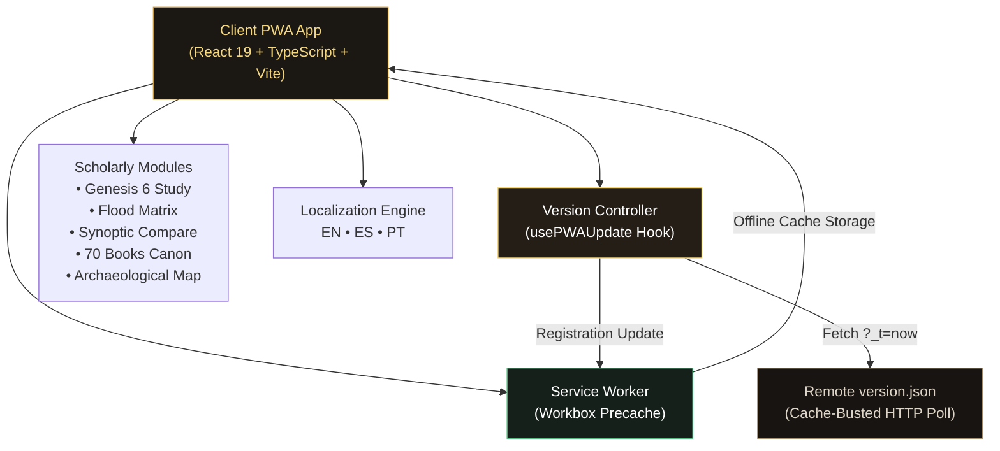
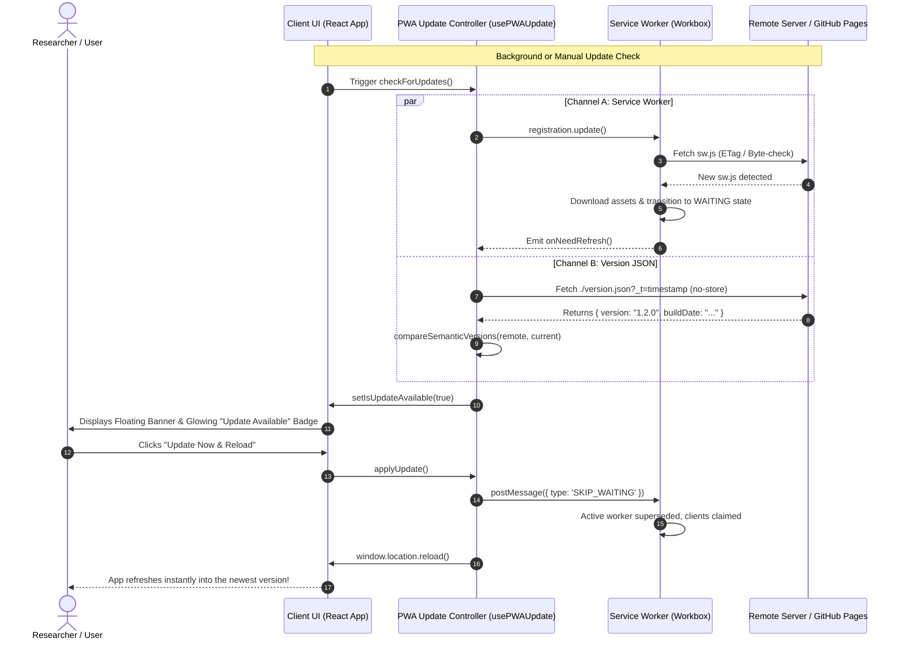
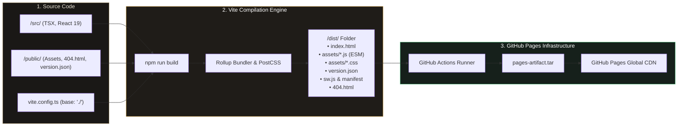
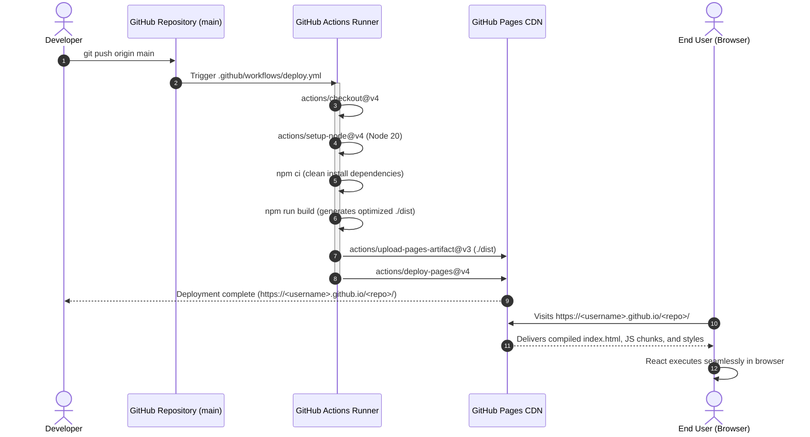

# Chronos & Canon: Ancient Text Comparative Archive

> A scholarly interactive archive and relationship explorer for ancient religious, mythological, apocryphal, and historical texts across global cultures. Built as an offline-first Progressive Web App (PWA) with client-side version control and automatic update management.

---

## Table of Contents
- [System Architecture & Capabilities](#system-architecture--capabilities)
- [Client-Side PWA Version Control & Update Controller](#client-side-pwa-version-control--update-controller)
  - [The Challenge: Service Workers & Stale Cache in PWAs](#the-challenge-service-workers--stale-cache-in-pwas)
  - [The Dual-Detection Engine](#the-dual-detection-engine)
  - [PWA Update Sequence (Mermaid Diagram)](#pwa-update-sequence-mermaid-diagram)
  - [User Interface & Update Controls](#user-interface--update-controls)
  - [Hard Cache Reset & Recovery](#hard-cache-reset--recovery)
  - [Release Workflow for Maintainers (Bumping Versions)](#release-workflow-for-maintainers-bumping-versions)
- [Progressive Web App (PWA) & Offline Architecture](#progressive-web-app-pwa--offline-architecture)
  - [Web App Manifest](#web-app-manifest)
  - [Service Worker & Workbox Precaching](#service-worker--workbox-precaching)
  - [Installing on Desktop, Android, and iOS](#installing-on-desktop-android-and-ios)
- [Core Scholarly Modules](#core-scholarly-modules)
  - [1. Synoptic Parallel Comparison Engine](#1-synoptic-parallel-comparison-engine)
  - [2. Genesis 6, The Watchers & The Giants Study](#2-genesis-6-the-watchers--the-giants-study)
  - [3. Great Deluge Comparative Matrix](#3-great-deluge-comparative-matrix)
  - [4. 31 Scholarly Relationship Dossiers](#4-31-scholarly-relationship-dossiers)
  - [5. Ethiopian Orthodox Canon & The 70 Books](#5-ethiopian-orthodox-canon--the-70-books)
  - [6. Archaeological Cartography & Excavation Dossiers](#6-archaeological-cartography--excavation-dossiers)
  - [7. Multilingual Architecture (EN, ES, PT)](#7-multilingual-architecture-en-es-pt)
- [Hosting on GitHub Pages: Why "Deploy from a Branch" Fails](#hosting-on-github-pages-why-deploy-from-a-branch-fails)
- [Architecture & Deployment Pipelines (Mermaid)](#architecture--deployment-pipelines-mermaid)
- [How to Deploy to GitHub Pages (Step-by-Step)](#how-to-deploy-to-github-pages-step-by-step)
  - [Method 1: GitHub Actions (Recommended & Included)](#method-1-github-actions-recommended--easiest)
  - [Method 2: Deploying to a `gh-pages` Branch](#method-2-deploying-to-a-gh-pages-branch)
  - [Method 3: Deploying via `/docs` Folder on `main`](#method-3-deploying-via-docs-folder-on-main)
- [Troubleshooting Common Deployment Errors](#troubleshooting-common-deployment-errors)
- [Local Development & Build Reference](#local-development--build-reference)

---

## System Architecture & Capabilities



| Dimension | Specification |
| :--- | :--- |
| **Framework** | React 19 SPA with TypeScript 5 & Vite 6 |
| **PWA Engine** | `vite-plugin-pwa` with Workbox runtime precaching |
| **Styling** | Tailwind CSS with ancient typographic palette & dark mode |
| **Script Typography** | Polytonic Greek (*Gentium Book Plus*), Biblical Hebrew (*Noto Serif Hebrew*), Classical Ethiopic (*Noto Serif Ethiopic*), Devanagari |
| **Languages** | Trilingual scholarly apparatus: English (`en`), Español (`es`), Português (`pt`) |
| **Offline Mode** | 100% offline study support for texts, relationships, and studies |
| **Version Control** | Automatic and on-demand client update detection with clean reload workflow |

---

## Client-Side PWA Version Control & Update Controller

### The Challenge: Service Workers & Stale Cache in PWAs

Progressive Web Apps utilize a Service Worker to intercept network requests and serve static assets directly from browser cache for instant loading and offline resilience. However, this introduces a classic distributed systems problem:

1. **Stale Asset Retention**: When a new release is pushed to GitHub Pages or a web server, clients already running the app continue executing the older cached service worker and JavaScript bundle.
2. **Chunk 404 Errors**: If an SPA dynamically imports route chunks and a user opens a new view while on an old release, the browser requests obsolete chunk hashes (e.g. `assets/CompareView-a1b2c3.js`), which no longer exist on the CDN, causing unhandled script crashes.
3. **Silent Drift**: Without proactive update checking, users can remain on outdated versions for weeks without ever realizing textual corrections or new features have been published.

### The Dual-Detection Engine

Chronos & Canon resolves this with a **Dual-Detection Engine** implemented in `src/hooks/usePWAUpdate.ts` and `src/context/PWAUpdateContext.tsx`:

```
┌────────────────────────────────────────────────────────────────────────┐
│                   DUAL-DETECTION UPDATE CONTROLLER                     │
├──────────────────────────────────┬─────────────────────────────────────┤
│   CHANNEL A: SERVICE WORKER      │   CHANNEL B: HTTP VERSION POLLING   │
├──────────────────────────────────┼─────────────────────────────────────┤
│ • Calls registration.update()    │ • Fetches ./version.json?_t=now     │
│ • Detects new SW downloading and │ • Bypasses browser cache with       │
│   entering "waiting" state       │   Cache-Control: no-cache, no-store │
│ • Dispatches onNeedRefresh event │ • Compares semantic versioning:     │
│ • Manages SKIP_WAITING lifecycle │   compareSemanticVersions(remote,   │
│                                  │   local) > 0                        │
└──────────────────────────────────┴─────────────────────────────────────┘
```

Both channels operate simultaneously:
- **On App Boot**: Checks 3 seconds after application startup.
- **On Visibility Change**: Automatically re-checks when the user returns to the tab after > 15 minutes of inactivity.
- **On Network Reconnect**: Re-checks as soon as the browser fires the `online` event.
- **Background Interval**: Re-checks periodically every 30 minutes while open.
- **Manual Trigger**: Available anytime via the **"Check for Updates"** button.

---

### PWA Update Sequence (Mermaid Diagram)



---

### User Interface & Update Controls

The archive provides clear, non-intrusive UI elements for managing updates:

1. **Floating Update Notification Banner (`UpdateNotificationBanner.tsx`)**:
   - Appears at the bottom of the screen as soon as a new version is detected.
   - Displays the target version number (e.g. `v1.2.0`), a summary of improvements, an **"Update Now"** button, a **"View What’s New"** link, and a dismiss button.

2. **Navigation Bar Version Badge (`Navigation.tsx`)**:
   - Located in the desktop header and mobile drawer.
   - Shows the active version (e.g. `v1.2.0`).
   - Displays a pulsing golden indicator when an update is waiting.
   - Clicking opens the **Version & System Updates Modal**.

3. **Version & Updates Modal (`VersionModal.tsx`)**:
   - Displays installed version, latest remote release, build date, and codename.
   - Shows runtime environment (`PWA Standalone App` vs `Web Browser`).
   - Reports Service Worker and offline cache health.
   - Features an interactive **"Check for Updates"** button with realistic progress spinner and timestamp.
   - Includes a full **Changelog & Release History** tab with trilingual notes (EN, ES, PT).

4. **Footer Status (`App.tsx`)**:
   - Displays installed version with a quick **"Check for Updates"** link.

---

### Hard Cache Reset & Recovery

In the event of corrupted local storage, stale caching, or broken client states, the Version Modal provides a **"Hard Cache Reset"** utility:

```typescript
// Located in src/hooks/usePWAUpdate.ts
export async function forceHardRefresh() {
  // 1. Unregister all active Service Workers
  if ('serviceWorker' in navigator) {
    const registrations = await navigator.serviceWorker.getRegistrations();
    for (const reg of registrations) {
      await reg.unregister();
    }
  }

  // 2. Clear all browser CacheStorage instances
  if ('caches' in window) {
    const cacheKeys = await caches.keys();
    await Promise.all(cacheKeys.map(key => caches.delete(key)));
  }

  // 3. Perform a clean hard reload from the server
  window.location.href = window.location.href.split('#')[0];
}
```

This guarantees an immediate clean state without requiring users to navigate complex browser setting menus.

---

### Release Workflow for Maintainers (Bumping Versions)

When publishing a new release of Chronos & Canon, follow this 4-step checklist:

#### Step 1: Bump version in `package.json`
```json
{
  "name": "chronos-canon",
  "version": "1.2.1"
}
```

#### Step 2: Update `public/version.json`
```json
{
  "version": "1.2.1",
  "buildDate": "2026-10-01T12:00:00Z",
  "codename": "Babylon & Nippur Edition",
  "releaseNotes": [
    "Added new synoptic parallel for Atrahasis Tablet I",
    "Enhanced polytonic Greek rendering on high-DPI displays"
  ]
}
```

#### Step 3: Register release in `src/version.ts`
```typescript
export const APP_VERSION = '1.2.1';
export const BUILD_DATE = '2026-10-01';
export const APP_CODENAME = 'Babylon & Nippur Edition';

export const VERSION_HISTORY: VersionRelease[] = [
  {
    version: '1.2.1',
    date: '2026-10-01',
    codename: 'Babylon & Nippur Edition',
    isLatest: true,
    highlights: {
      en: ['Added new synoptic parallel for Atrahasis Tablet I', 'Enhanced polytonic Greek rendering on high-DPI displays'],
      es: ['Añadido nuevo paralelo sinóptico para Atrahasis Tablilla I', 'Mejorada la representación del griego politónico en pantallas de alta densidad'],
      pt: ['Adicionado novo paralelo sinóptico para Atrahasis Tábua I', 'Renderização aprimorada de grego politônico em telas de alta densidade']
    }
  },
  // Previous versions preserved below...
];
```

#### Step 4: Build and Deploy
```bash
npm run build
git add .
git commit -m "release: v1.2.1 (Babylon & Nippur Edition)"
git push origin main
```
Once deployed, all running client instances will detect the update within minutes and offer users a seamless single-click refresh!

---

## Progressive Web App (PWA) & Offline Architecture

### Web App Manifest

Configured in `vite.config.ts` and injected automatically:
- **`id`**: `'./'`
- **`start_url`**: `'./'` (preserves compatibility with GitHub Pages subpaths)
- **`display`**: `'standalone'` (hides browser chrome for native app experience)
- **`theme_color`**: `'#12100e'` (matches ancient dark papyrus styling)
- **`background_color`**: `'#12100e'`
- **Icons**: Compliant PNG assets in `public/`:
  - `pwa-192x192.png` (Standard mobile launcher icon)
  - `pwa-512x512.png` (High-resolution splash screen icon)
  - `pwa-maskable-512x512.png` (15% safe-zone margin for Android squircle cropping)
  - `apple-touch-icon.png` (180x180 PNG for iOS home screen shortcuts)

### Service Worker & Workbox Precaching

- **Asset Precaching**: Pre-caches all production CSS, JS bundles, HTML, SVG, and web fonts.
- **Runtime Caching for Google Fonts**:
  - `https://fonts.googleapis.com` & `https://fonts.gstatic.com` cached with a 1-year `CacheFirst` policy.
- **Network-First for Updates**:
  - `version.json` configured with `NetworkOnly` to guarantee fresh version metadata on every poll.
- **Update Mode**: Set to `registerType: 'prompt'` to avoid abrupt session interruption while users are actively studying.

### Installing on Desktop, Android, and iOS

- **Desktop (Chrome / Edge)**: Click the **"Install App"** button in the header or the address bar install icon.
- **Android**: Tap the **"Install App"** button to trigger the native WebAPK installation banner.
- **iOS Safari**: Tap the **"Install on iOS"** button for guided instructions:
  1. Tap the **Share** button in Safari's bottom toolbar.
  2. Select **"Add to Home Screen"**.
  3. Launch Chronos & Canon as a standalone full-screen application.

---

## Core Scholarly Modules

### 1. Synoptic Parallel Comparison Engine
- Dynamic dual-column comparison viewer for side-by-side text analysis.
- Verse-by-verse alignment between biblical chapters and ancient Near Eastern epigraphic precursors.
- Independent language selector per column allowing simultaneous comparative study (e.g. Column A in Hebrew/Greek, Column B in Spanish/English).

### 2. Genesis 6, The Watchers & The Giants Study
- Four-step interactive historical-critical dossier on Genesis 6:1–4 (*Bene ha-Elohim*, *Nephilim*, *Gibborim*).
- Comparative alignment with:
  - 1 Enoch 6–11 (Book of the Watchers / Mount Hermon descent).
  - Qumran Book of Giants (4Q530, 4Q531, Gilgamesh & Hobabish mentions).
  - New Testament epistles (Jude 6, 14–15, 2 Peter 2:4 Tartarus traditions).
  - Mesopotamian Apkallu fish-sage traditions (Eridu & Uruk flood-era wisdom).
  - Classical Greek Titanomachy & Hesiodic parallels.

### 3. Great Deluge Comparative Matrix
- Comprehensive multi-tradition flood comparison:
  - *Atrahasis Tablet III* (Akkadian, ca. 1640 BCE).
  - *Epic of Gilgamesh Tablet XI* (Standard Babylonian version).
  - *Genesis 6–9* (Priestly & Yahwistic accounts).
  - *Berossus Babyloniaca* (Hellenistic Babylonian priest).
  - *Shatapatha Brahmana* (Manu and the Matsya avatar).
  - *Popol Vuh* (K'iche' Maya wooden people deluge).
- Structured comparative breakdown of vessel specifications, bird release reconnaissance tests, bitumen sealing methods, and post-flood sweet-savor sacrifices.

### 4. 31 Scholarly Relationship Dossiers
- Rigorous typological tagging across all connections:
  - `DIRECT QUOTATION` (Verbatim citation).
  - `TEXTUAL DEPENDENCE` (Structural borrowing).
  - `SHARED TRADITION` (Common Northwest Semitic or Levantine motif).
  - `POLEMICAL SUBVERSION` (Intentional ideological inversion of foreign myth).
  - `PARALLEL MOTIF` (Typological archetype).
- Evidentiary confidence levels: `PRIMARY DIRECT`, `STRONG DOCUMENTED`, `HISTORICAL PROBABLE`, `SCHOLARLY HYPOTHESIS`.

### 5. Ethiopian Orthodox Canon & The 70 Books
- Dedicated explorer for the 81-book broader canon (*Mets'hafe Berhan*).
- Interactive navigation across the *Bole* (Law), *Nebiyat* (Prophets), *Ketubim* (Writings), *Apocrypha*, *Pseudepigrapha*, and Ethiopian Unique Books (1 Enoch, Jubilees, 1-3 Meqabyan).

### 6. Archaeological Cartography & Excavation Dossiers
- Interactive equirectangular coordinate map of the ancient world.
- Detailed dossiers for archaeological discovery sites:
  - Qumran Caves (Dead Sea Scrolls).
  - Ras Shamra (Ugaritic tablets, Baal Cycle).
  - Kuyunjik / Nineveh (Library of Ashurbanipal).
  - Warka / Uruk (Epic of Gilgamesh).
  - Elephantine Island (Aramaic papyri).
  - Amarna (Diplomatic cuneiform archive).

### 7. Multilingual Architecture (EN, ES, PT)
- Complete interface, study view, and primary passage translations:
  - **English (EN)**: Scholarly English translations grounded in modern critical editions.
  - **Español (ES)**: Comprehensive Latin American & Peninsular scholarly Spanish translations.
  - **Português (PT)**: Fluent academic Portuguese apparatus.
- Instant toggle from the navigation bar without page reloads.

---

## Hosting on GitHub Pages: Why "Deploy from a Branch" Fails

When you choose **"Deploy from a branch"** (e.g. `main` -> `/ (root)`) in GitHub Pages settings, GitHub Pages assumes your repository contains ready-to-serve, static, pre-compiled HTML, CSS, and vanilla JavaScript files.

However, this repository is a modern **React + TypeScript + Vite Single Page Application (SPA)**. Here is why deploying directly from the raw `main` branch breaks:


### The 4 Culprits:
1. **Uncompiled TypeScript/JSX**: Browsers only execute standard JavaScript (`.js`). Source files in `/src` use `.tsx` syntax with JSX expressions (`<Component />`) and TypeScript types, requiring the Vite build step (`npm run build`) to transpile into vanilla ECMAScript.
2. **Unresolved Bare Module Imports**: In `/src/main.tsx`, imports like `import React from 'react'` and `import { LucideIcon } from 'lucide-react'` require Rollup to resolve node module packages into self-contained web bundles.
3. **The `dist/` Directory Is Gitignored**: The compiled output folder (`dist/`) is intentionally not committed to `main` to prevent merge conflicts and repository bloat.
4. **Subdirectory Base Path Mismatch**: Standard GitHub Pages URLs reside at `https://<username>.github.io/<repository-name>/`. Without `base: './'` in `vite.config.ts`, browsers request `/assets/...` from the root domain, resulting in 404 errors for all CSS and JavaScript.

---

## Architecture & Deployment Pipelines (Mermaid)

### 1. Build and Deployment Pipeline



### 2. GitHub Actions Deployment Sequence



---

## How to Deploy to GitHub Pages (Step-by-Step)

### Method 1: GitHub Actions (Recommended & Easiest)

This repository **already includes** the required GitHub Actions workflow at [`.github/workflows/deploy.yml`](.github/workflows/deploy.yml) and the relative asset path configuration in `vite.config.ts`.

#### Step 1: Push the Repository to GitHub
Make sure all repository files (including the `.github` folder) are committed and pushed to your GitHub repository:
```bash
git add .
git commit -m "feat: configure PWA version control and GitHub Actions deployment"
git push origin main
```

#### Step 2: Enable GitHub Actions as the Pages Source
1. Open your repository on GitHub (`https://github.com/<username>/<repo-name>`).
2. Click on the **Settings** tab.
3. In the left-hand navigation sidebar, click on **Pages** (under the "Code and automation" section).
4. Under **Build and deployment**:
   - Change **Source** from *"Deploy from a branch"* to **"GitHub Actions"**.
5. Save settings.

```
Settings
  └── Pages
        └── Build and deployment
              └── Source: [ GitHub Actions ▼ ]  <-- Select this!
```

#### Step 3: Verify the Deployment
1. Click on the **Actions** tab in your repository.
2. Observe the running workflow named **"Deploy Chronos & Canon to GitHub Pages"**.
3. Once completed (usually 45–60 seconds), your live URL will appear in the deployment summary:
   `https://<username>.github.io/<repo-name>/`

---

### Method 2: Deploying to a `gh-pages` Branch

If your organization requires the classic **"Deploy from a branch"** option, deploy the *compiled `dist` folder* to an isolated branch named `gh-pages`:

#### Step 1: Install `gh-pages`
```bash
npm install --save-dev gh-pages
```

#### Step 2: Add deploy scripts to `package.json`
```json
"scripts": {
  "predeploy": "npm run build",
  "deploy": "gh-pages -d dist"
}
```

#### Step 3: Build and Deploy
```bash
npm run deploy
```

#### Step 4: Configure GitHub Pages
1. Go to **Settings** -> **Pages**.
2. Under **Build and deployment**:
   - Source: **Deploy from a branch**.
   - Branch: Select **`gh-pages`** and folder **`/ (root)`**.
3. Click **Save**.

---

### Method 3: Deploying via `/docs` Folder on `main`

If you must stay on the `main` branch with "Deploy from a branch":

1. In `vite.config.ts`, set `build.outDir` to `'docs'`:
   ```ts
   export default defineConfig({
     base: './',
     build: {
       outDir: 'docs',
     },
     // ...
   });
   ```
2. Build the app locally:
   ```bash
   npm run build
   ```
3. Commit and push the generated `docs` directory:
   ```bash
   git add docs/
   git commit -m "build: compile static production bundle to /docs"
   git push origin main
   ```
4. In GitHub -> **Settings** -> **Pages**:
   - Source: **Deploy from a branch**.
   - Branch: **`main`**.
   - Folder: Select **`/docs`**.
5. Click **Save**.

---

## Troubleshooting Common Deployment Errors

### 1. "Failed to load module script: Expected a JavaScript-compatible script"
- **Cause**: GitHub Pages is serving raw `.tsx` files directly from `main` without compilation.
- **Fix**: Switch the Pages Source to **GitHub Actions** (Method 1) so Vite compiles your code into executable `.js` bundles first.

### 2. Blank White Screen & 404 on CSS/JS Assets (`/assets/index-xxx.js 404 Not Found`)
- **Cause**: Asset URLs are absolute (`/assets/...`) instead of relative (`./assets/...`). GitHub project pages reside at `https://<user>.github.io/<repo>/`, so absolute paths look for assets at the root domain (`https://<user>.github.io/assets/...`).
- **Fix**: This project already has `base: './'` in `vite.config.ts`. If you ever change bundlers, ensure relative base paths are preserved.

### 3. Page Reload / Direct Route 404s (SPA Routing)
- **Cause**: GitHub Pages is a static file server. If a user navigates to `/compare` and refreshes, GitHub looks for a directory named `/compare/index.html` which does not exist.
- **Fix**: This project includes [`public/404.html`](public/404.html), an automated client-side redirect script that forwards any 404 path back to `index.html` with route restoration parameters.

### 4. GitHub Actions Workflow Permission Denied
- **Cause**: Workflow lacks write permissions for Pages deployment.
- **Fix**: The included `.github/workflows/deploy.yml` specifies:
  ```yaml
  permissions:
    contents: read
    pages: write
    id-token: write
  ```
  Ensure under **Settings** -> **Actions** -> **General** -> **Workflow permissions**, "Read and write permissions" is checked.

### 5. Stale Client Version After New Push
- **Cause**: The client's Service Worker has cached the older assets.
- **Fix**: The archive's PWA Version Controller will prompt the user with an "Update Available" banner within 3 seconds of connection or upon tab refocus. Alternatively, click the version button in the footer and select **"Check for Updates"** or **"Hard Cache Reset"**.

---

## Local Development & Build Reference

| Command | Action | Description |
| :--- | :--- | :--- |
| `npm install` | Install Dependencies | Installs all React, Vite, Workbox, and UI dependencies |
| `npm run dev` | Start Dev Server | Launches local development server at `http://localhost:3000` |
| `npm run build` | Production Build | Compiles TypeScript, bundles assets, and generates PWA Service Worker in `/dist` |
| `npm run build:gh-pages` | GitHub Pages Build | Explicitly builds with relative path resolution for static subpaths |
| `npm run preview` | Preview Production | Serves the generated `/dist` folder locally for pre-flight testing |
| `npm run lint` | TypeScript Validation | Executes `tsc --noEmit` to verify type safety across all files |
| `npm run clean` | Clean Artifacts | Removes `/dist` and temporary build cache |

---

## License & Scholarly Citation

Chronos & Canon is an open scholarly research initiative. Textual selections and lexical apparatus are assembled from open-access academic editions, epigraphic publications, and public domain historical corpora.
