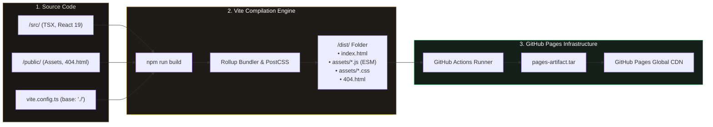
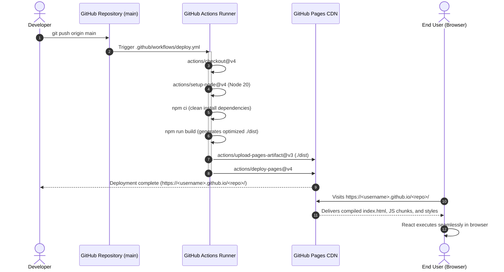
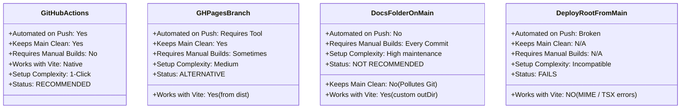

# Chronos & Canon: Ancient Text Comparative Archive

> A scholarly interactive archive and relationship explorer for ancient religious, mythological, apocryphal, and historical texts across global cultures.

---

## Table of Contents
- [Why "Deploy from a Branch" Fails (The Technical Problem)](#why-deploy-from-a-branch-fails-the-technical-problem)
- [Architecture & Deployment Flowcharts (Mermaid)](#architecture--deployment-flowcharts-mermaid)
- [Deployment Method Comparison](#deployment-method-comparison)
- [How to Host on GitHub Pages (Step-by-Step)](#how-to-host-on-github-pages-step-by-step)
  - [Method 1: GitHub Actions (Recommended & Included)](#method-1-github-actions-recommended--easiest)
  - [Method 2: Deploying to a `gh-pages` Branch](#method-2-deploying-to-a-gh-pages-branch)
  - [Method 3: Deploying via `/docs` Folder on `main`](#method-3-deploying-via-docs-folder-on-main)
- [Troubleshooting Common GitHub Pages Errors](#troubleshooting-common-github-pages-errors)
- [Local Development & Building](#local-development--building)

---

## Why "Deploy from a Branch" Fails (The Technical Problem)

When you choose **"Deploy from a branch"** (e.g. `main` -> `/ (root)`) in GitHub Pages settings, GitHub Pages assumes your repository contains ready-to-serve, static, pre-compiled HTML, CSS, and vanilla JavaScript files.

However, this repository is a modern **React + TypeScript + Vite Single Page Application (SPA)**. Here is why deploying directly from the raw `main` branch breaks:


### The 4 Culprits:
1. **Uncompiled TypeScript/JSX**: Browsers only execute standard JavaScript (`.js`). Your source code in `/src` uses `.tsx` and `.ts` syntax with JSX expressions (`<Component />`) and TypeScript types, which requires the Vite build step (`npm run build`) to transpile into vanilla ECMAScript.
2. **Unresolved Bare Module Imports**: In `/src/main.tsx`, imports like `import React from 'react'` and `import { LucideIcon } from 'lucide-react'` require a bundler to resolve node module packages into self-contained web bundles.
3. **The `dist/` Directory Is Gitignored**: The compiled output folder (`dist/`) is intentionally not committed to the `main` branch (which is standard practice to prevent merge conflicts and repository bloat).
4. **Subdirectory Base Path Mismatch**: Standard GitHub Pages project URLs live under `https://<username>.github.io/<repository-name>/`. Without `base: './'` configured in `vite.config.ts`, browsers request `/assets/...` from the root domain `https://<username>.github.io/assets/...`, resulting in 404 for all CSS and JavaScript.

---

## Architecture & Deployment Flowcharts (Mermaid)

### 1. Build and Deployment Pipeline



### 2. GitHub Actions Deployment Sequence



---

## Deployment Method Comparison



### Detailed Matrix Table

| Feature / Criteria | 🌟 Option 1: GitHub Actions (Recommended) | 🌿 Option 2: `gh-pages` Branch | 📁 Option 3: `/docs` Subfolder | ❌ Option 4: Deploy from `main` Root |
| :--- | :--- | :--- | :--- | :--- |
| **Workflow File** | Included in `.github/workflows/deploy.yml` | None (or branch push script) | None | None |
| **Browser Compatibility** | **100% (Vite production bundle)** | **100% (Vite production bundle)** | **100% (Vite production bundle)** | **0% (Fails to parse `.tsx` and modules)** |
| **Asset Base Path** | Automated relative `./` | Automated relative `./` | Automated relative `./` | 404 Not Found on `/assets/` |
| **Single Page Routing (404s)** | Handled by `/public/404.html` | Handled by `/public/404.html` | Requires copy to `/docs` | Broken |
| **Clean Git History** | Pristine (no build artifacts committed) | Clean (build artifacts in separate orphan branch) | Cluttered (dist binaries checked into main) | Clean but broken application |
| **Maintenance Effort** | **Zero (Push and forget)** | Run `npm run deploy` on each update | Run `npm run build` and commit `/docs` | Does not work |

---

## How to Host on GitHub Pages (Step-by-Step)

### Method 1: GitHub Actions (Recommended & Easiest)

This repository **already includes** the required GitHub Actions workflow at [`.github/workflows/deploy.yml`](.github/workflows/deploy.yml) and the relative asset path configuration in `vite.config.ts`.

#### Step 1: Push the Repository to GitHub
Make sure all repository files (including the `.github` folder) are committed and pushed to your GitHub repository:
```bash
git add .
git commit -m "feat: configure GitHub Pages with automated GitHub Actions"
git push origin main
```

#### Step 2: Enable GitHub Actions as the Pages Source
1. Open your repository on GitHub (`https://github.com/<username>/<repo-name>`).
2. Click on the **Settings** tab (the gear icon on top).
3. In the left-hand navigation sidebar, click on **Pages** (under the "Code and automation" section).
4. Under **Build and deployment**:
   - Find the dropdown labeled **Source**.
   - Change it from *"Deploy from a branch"* to **"GitHub Actions"**.
5. You're done! No additional forms or branches needed.

```
Settings
  └── Pages
        └── Build and deployment
              └── Source: [ GitHub Actions ▼ ]  <-- Select this!
```

#### Step 3: Verify the Deployment
1. Click on the **Actions** tab in your repository.
2. You will see a workflow running named **"Deploy Chronos & Canon to GitHub Pages"**.
3. Once completed (usually 45–60 seconds), your live URL will be shown in the deployment summary:
   `https://<username>.github.io/<repo-name>/`

---

### Method 2: Deploying to a `gh-pages` Branch

If your organization requires the classic **"Deploy from a branch"** option, you must deploy the *compiled `dist` folder* to an isolated branch named `gh-pages` (not the uncompiled `main` branch).

#### Step 1: Install the `gh-pages` utility
```bash
npm install --save-dev gh-pages
```

#### Step 2: Add deploy scripts to `package.json`
Add these two lines to the `"scripts"` section of `package.json`:
```json
"scripts": {
  "predeploy": "npm run build",
  "deploy": "gh-pages -d dist"
}
```

#### Step 3: Build and Deploy to `gh-pages`
Run:
```bash
npm run deploy
```
This automatically builds the project into `dist/` and pushes only the built static assets to a new `gh-pages` branch on your remote repository.

#### Step 4: Configure GitHub Pages
1. Go to **Settings** -> **Pages**.
2. Under **Build and deployment**:
   - Source: **Deploy from a branch**.
   - Branch: Select **`gh-pages`** and folder **`/ (root)`**.
3. Click **Save**.

---

### Method 3: Deploying via `/docs` Folder on `main`

If you must stay on the `main` branch with "Deploy from a branch":

1. Open `vite.config.ts` and set `build.outDir` to `'docs'`:
   ```ts
   export default defineConfig({
     base: './',
     build: {
       outDir: 'docs',
     },
     // ...
   });
   ```
2. Build the app locally:
   ```bash
   npm run build
   ```
3. Commit and push the generated `docs` directory:
   ```bash
   git add docs/
   git commit -m "build: compile static production bundle to /docs"
   git push origin main
   ```
4. In GitHub -> **Settings** -> **Pages**:
   - Source: **Deploy from a branch**.
   - Branch: **`main`**.
   - Folder: Select **`/docs`**.
5. Click **Save**.

---

## Troubleshooting Common GitHub Pages Errors

### 1. "Failed to load module script: Expected a JavaScript-compatible script"
- **Cause**: GitHub Pages is serving raw `.tsx` files directly from `main` without compilation.
- **Fix**: Switch the Pages Source to **GitHub Actions** (Method 1) so Vite compiles your code into executable `.js` bundles first.

### 2. Blank White Screen & 404 on CSS/JS Assets (`/assets/index-xxx.js 404 Not Found`)
- **Cause**: Asset URLs are absolute (`/assets/...`) instead of relative (`./assets/...`). GitHub project pages reside at `https://<user>.github.io/<repo>/`, so absolute paths look for assets at the root domain (`https://<user>.github.io/assets/...`).
- **Fix**: This project already has `base: './'` in `vite.config.ts`. If you ever change bundlers, ensure relative base paths are enabled.

### 3. Page Reload / Direct Route 404s (SPA Routing)
- **Cause**: GitHub Pages is a static file server. If a user navigates to `/compare` and refreshes, GitHub looks for a directory named `/compare/index.html` which does not exist.
- **Fix**: This project includes [`public/404.html`](public/404.html), an automated client-side redirect script that forwards any 404 path back to `index.html` with route restoration parameters.

### 4. GitHub Actions Workflow Permission Denied
- **Cause**: Workflow lacks write permissions for Pages deployment.
- **Fix**: The included `.github/workflows/deploy.yml` specifies:
  ```yaml
  permissions:
    contents: read
    pages: write
    id-token: write
  ```
  Ensure under **Settings** -> **Actions** -> **General** -> **Workflow permissions**, "Read and write permissions" is checked (or at minimum "Read repository contents and packages permissions").

---

## Local Development & Building

| Command | Action |
| :--- | :--- |
| `npm install` | Install all required dependencies |
| `npm run dev` | Start development server with live reload at `http://localhost:3000` |
| `npm run build` | Build the optimized static bundle for production to `/dist` |
| `npm run build:gh-pages` | Explicitly build with relative paths for GitHub Pages |
| `npm run preview` | Locally preview the compiled production `/dist` build |
| `npm run lint` | Validate TypeScript types and project syntax |

---

## Key Features in the Archive

- **Tripartite Chronological Differentiation**: Strict separation between:
  1. *Primary / Contemporaneous Witnesses* (Epigraphic tablets, Qumran Dead Sea Scrolls, Ugaritic tablets).
  2. *Secondary Literary Transmission* (Medieval Masoretic codices, Septuagint translations, Patristic collections).
  3. *Tertiary Reconstructions* (Modern scholarly critical editions, hypothetical lost source traditions).
- **Ancient Script Typography**: Authentic polytonic Greek (*Gentium Book Plus*), Biblical Hebrew with vowel cantillation (*Noto Serif Hebrew*), and Vedic Devanagari.
- **Interactive Multi-Regional Map**: Zoomable equirectangular cartographic canvas with coordinates and archaeological dossiers.
- **Institutional Digital Library**: Direct open-access portals to official repositories (Leon Levy Dead Sea Scrolls Library, Sefaria, Perseus Digital Library, British Museum Collections, ETCSL).
- **Offline / PWA Ready**: Service worker caching and Progressive Web App manifest for offline study.
